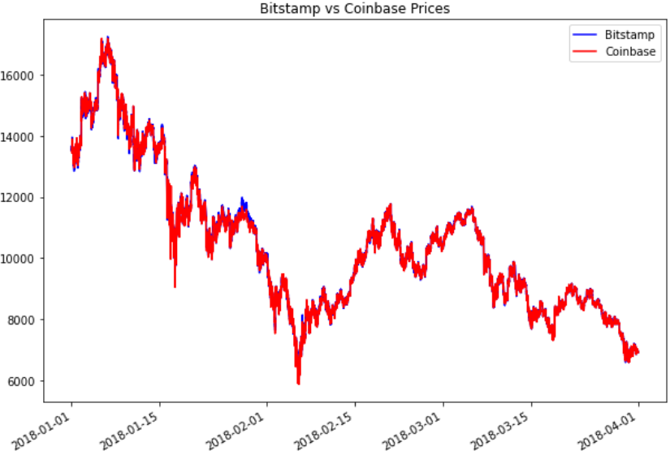

## UCB_Fintech_Challenge_3
# Financial Analysis with Pandas
In this analysis I chose 3 different dates from the period lasting from 01/01/2018 to 03/31/2018.
The purpose of the analysis was to determine whether there were any arbitrage opportunities between two different cryptocurrency market places for Bitcoin, Bitstamp and Coinbase.
My hypothesis going in to this challenge was that if any arbitrage opportunities did exist, they would not for long as the market recorrected itself.
My first discovery was made after I plotted the price of Bitcoin on the two marketplaces and looked at them together
