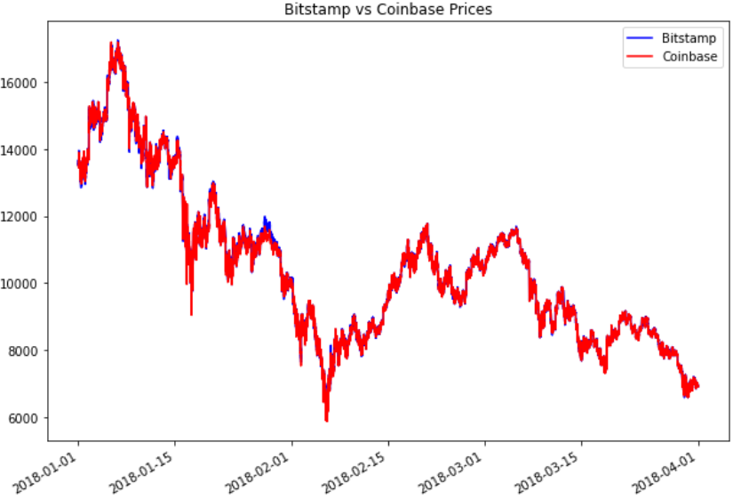
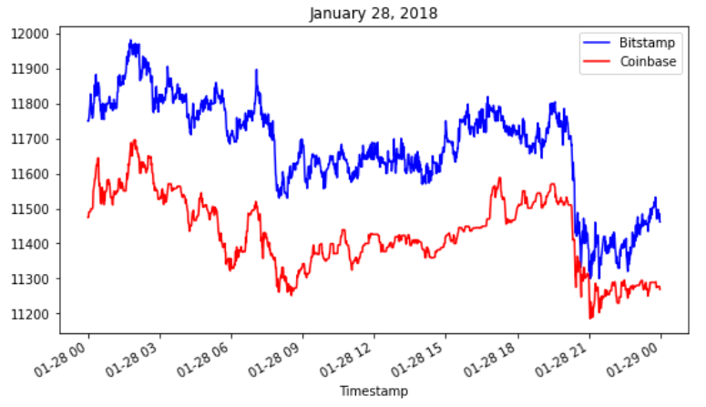
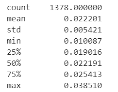
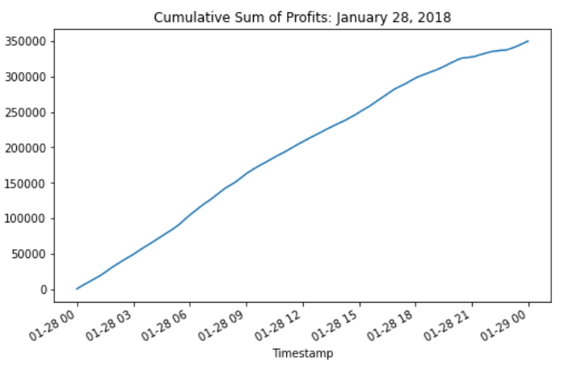
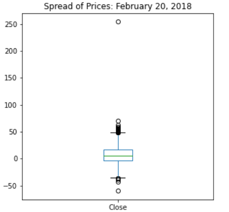

# UCB_Fintech_Challenge_3
## Financial Analysis with Pandas
>In this analysis I chose 3 different dates from the period lasting from 01/01/2018 to 03/31/2018.  
The purpose of the analysis was to determine whether there were any arbitrage opportunities between two different cryptocurrency market places for Bitcoin, Bitstamp and Coinbase.  
My hypothesis going in to this challenge was that if any arbitrage opportunities did exist, they would not for long as the market recorrected itself.

My first discovery was made after I plotted the price of Bitcoin on the two marketplaces and looked at them together.  

I noticed that near the end of January there looked like gap between the marketplaces, so I chose January 28th to investigate further.  
Sure enough, there was a significant difference in the two prices on that day.  

  

By looking at the summary statistics for the 28th, we can see that it was an extremely profitable day for anyone able to recognize the arbitrage opportunity.  

1378 of 1436 profitable trades were large enough that they were still profitable even one percent transactional fees per trade were applied, with an average return of 2.2 percent per trade. While that may sound small, with so many profitable trading periods over the course of the day, the profits would quickly snowball, even if it was just one Bitcoin traded per profitable period, without reinvesting any profit!

By the end of the day, one trader buying one Bitcoin on Coinbase and immediately selling on Bitstamp every minute there was a profitable opportunity above the one percent threshold could have made just shy of $350,000.  

However, the other two days were not nearly as fruitful. The selection of February 20th and March 22nd were relatively arbitrary, as the 3 month graph didn't show any days other periods of sustained divergence in price. it turns out that there was one profitable trade on February 20th, an outlier during that day's trading.

There were no profitable trades that exceeded the one percent threshold on the final day that I analyzed, March 22nd.

## Summary

As far as the hypothesis went, I think it was borne out in the data. While clearly there are massive opportunities to be had in exploiting arbitrage, by their nature they don't last long. But I was not expecting such a profitable day as January 28th, which shows the power of recognizing arbitrage opportunities, and why it makes sense to track markets where one thinks they may arise.